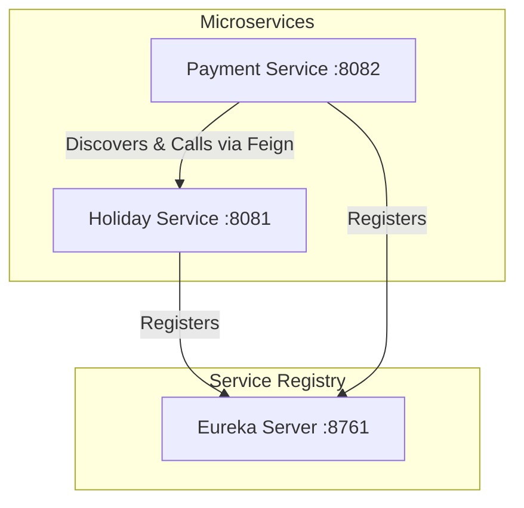

# Talent Cloud Services - Holiday & Payment Microservices

This project is a modern, modular Spring Cloud microservices architecture built to manage holidays and calculate payments using Java 21, Spring Boot, Spring Cloud Eureka for service discovery, and OpenFeign for declarative REST client invocation.

## 🏛️ Architecture Overview

The system consists of three modules:
1. **`eureka-server`** (Port `8761`): The service registry where all microservices register themselves.
2. **`holiday-service`** (Port `8081`): Manages and exposes a list of public holidays, including their rate multipliers (e.g., double pay for Christmas).
3. **`payment-service`** (Port `8082`): Performs payment calculations. It uses **OpenFeign** to dynamically lookup the `holiday-service` via **Eureka**, checks if a working day falls on a holiday, and applies the corresponding rate multiplier.



---

## 🛠️ Build and Running the Applications

### Prerequisites
- **Java 21** or higher.
- **Maven** (configured using the included Maven Wrapper `./mvnw`).

### 1. Build the Project
From the root directory, run the Maven wrapper to package all microservices:
```bash
./mvnw clean package -DskipTests
```

### 2. Run the Microservices (in Order)

To run the services locally, open separate terminal windows and run:

#### **Step 2.1: Start Eureka Server**
```bash
cd eureka-server
../mvnw spring-boot:run
```
*Wait a few seconds until the server starts. You can access the Eureka dashboard at [http://localhost:8761](http://localhost:8761).*

#### **Step 2.2: Start Holiday Service**
```bash
cd holiday-service
../mvnw spring-boot:run
```

#### **Step 2.3: Start Payment Service**
```bash
cd payment-service
../mvnw spring-boot:run
```

---

## 🔌 API Documentation & Test Endpoints

### 1. Holiday Service (`http://localhost:8081`)

#### **Get All Holidays**
Retrieve the list of all registered holidays for the current year.
- **URL:** `/api/holidays`
- **Method:** `GET`
- **Curl:**
  ```bash
  curl http://localhost:8081/api/holidays
  ```
- **Example Response:**
  ```json
  [
    {
      "date": "2026-01-01",
      "name": "New Year's Day",
      "rateMultiplier": 2.0
    },
    {
      "date": "2026-07-04",
      "name": "Independence Day",
      "rateMultiplier": 2.0
    },
    {
      "date": "2026-12-25",
      "name": "Christmas Day",
      "rateMultiplier": 2.0
    }
  ]
  ```

#### **Check Holiday by Date**
Retrieve details of a holiday on a specific date. Returns `404 Not Found` if it is not a holiday.
- **URL:** `/api/holidays/{date}`
- **Method:** `GET`
- **Curl:**
  ```bash
  curl http://localhost:8081/api/holidays/2026-12-25
  ```

#### **Check If Date Is a Holiday**
Simple true/false query.
- **URL:** `/api/holidays/check?date=2026-07-04`
- **Method:** `GET`
- **Curl:**
  ```bash
  curl "http://localhost:8081/api/holidays/check?date=2026-07-04"
  ```
- **Example Response:** `true`

---

### 2. Payment Service (`http://localhost:8082`)

The Payment Service connects to Eureka, locates the `holiday-service` instance, and calculates whether the requested day yields premium pay.

#### **Calculate Payment (GET - Quick Query)**
Quick calculation using URL query parameters.
- **URL:** `/api/payments/calculate`
- **Method:** `GET`
- **Parameters:**
  - `baseDailyRate` (double): The standard daily wage (e.g. `250.0`)
  - `date` (YYYY-MM-DD): The date worked
- **Curl:**
  ```bash
  curl "http://localhost:8082/api/payments/calculate?baseDailyRate=250.0&date=2026-12-25"
  ```
- **Example Response (Christmas Day - Double Pay):**
  ```json
  {
    "date": "2026-12-25",
    "baseDailyRate": 250.0,
    "isHoliday": true,
    "holidayName": "Christmas Day",
    "rateMultiplier": 2.0,
    "calculatedPayment": 500.0
  }
  ```

- **Example Response (Regular Workday - 2026-10-15):**
  ```bash
  curl "http://localhost:8082/api/payments/calculate?baseDailyRate=250.0&date=2026-10-15"
  ```
  ```json
  {
    "date": "2026-10-15",
    "baseDailyRate": 250.0,
    "isHoliday": false,
    "holidayName": null,
    "rateMultiplier": 1.0,
    "calculatedPayment": 250.0
  }
  ```

#### **Calculate Payment (POST - JSON payload)**
Standard API request.
- **URL:** `/api/payments/calculate`
- **Method:** `POST`
- **Headers:** `Content-Type: application/json`
- **Body:**
  ```json
  {
    "baseDailyRate": 300.0,
    "date": "2026-07-04"
  }
  ```
- **Curl:**
  ```bash
  curl -X POST http://localhost:8082/api/payments/calculate \
    -H "Content-Type: application/json" \
    -d '{"baseDailyRate": 300.0, "date": "2026-07-04"}'
  ```
